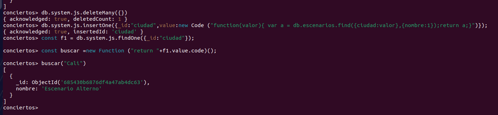

# Festival de Conciertos en Colombia

## Consultas

### Expresiones Regulares

**Buscar bandas cuyo nombre empiece por la letra “A”**  

    db.bandas.find({nombre:{$regex: "^[Aa]"}})

**Buscar asistentes cuyo nombre contenga "Gómez".**  

    db.asistentes.find({nombre:{$regex:"Gómez"}})

### Operadores de Arreglos

**Buscar asistentes que tengan "Rock" dentro de su campo generos_favoritos.**  

    db.asistentes.find({generos_favoritos:{$regex:"Rock"}})

### Aggregation Framework

**Agrupar presentaciones por escenario y contar cuántas presentaciones hay por cada uno.**  

    db.presentaciones.aggregate([{$group:{_id:"$escenario", totalPresentaciones:{$sum:1}}}])

**Calcular el promedio de duración de las presentaciones.**  

    db.presentaciones.aggregate([{$group:{_id:"$banda",promedio:{$avg:"$duracion_minutos"}}}])

## Funciones en system.js

**Crear una función llamada escenariosPorCiudad(ciudad) que devuelva todos los escenarios en esa ciudad.** 

    db.system.js.insertOne({_id:"ciudad",value:new Code ("function(valor){ var a = db.escenarios.find({ciudad:valor},{nombre:1});return a;}")});

**Crear una función llamada bandasPorGenero(genero) que devuelva todas las bandas activas de ese género.** 

    db.system.js.insertOne({_id:'genero',value:new Code ("function(valor){const a = db.bandas.find({genero:valor},{nombre:1});return a;}")});

## Transacciones (requiere replica set)

### Simular compra de un boleto:

**Insertar nuevo boleto en boletos_comprados de un asistente y Disminuir en 1 la capacidad del escenario correspondiente.**

    db.system.js.insertOne({
    _id: "comprarBoleto",
    value: new Code(
        "function(a,e,f){" +
        "db.asistentes.updateOne(" +
            "{_id:ObjectId(a)}," +
            "{$push:{boletos_comprados:{escenario:e,dia:f}}}" +
        ");" +
        "let r=db.escenarios.updateOne(" +
            "{nombre:e,capacidad:{$gt:0}}," +
            "{$inc:{capacidad:-1}}" +
        ");" +
        "if(r.modifiedCount===0)throw new Error('No hay capacidad');" +
        "return{success:true}" +
        "}"
    )
    });

